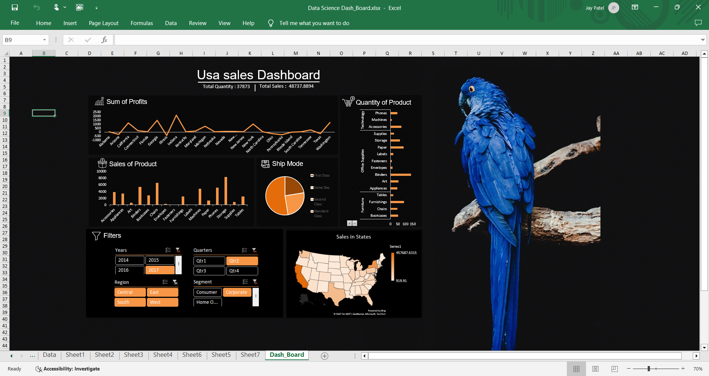

# USA Sales Dashboard

A dynamic sales dashboard built in Excel to analyze and visualize USA sales data. The dashboard provides insights into total sales, profits, product quantities, and sales by state. It also includes interactive filters for detailed exploration.

## Features
- **Sum of Profits**: Line chart showing profits over different categories.
- **Sales of Product**: Bar chart visualizing sales by product type.
- **Quantity of Product**: Horizontal bar chart for product quantities sold.
- **Ship Mode Distribution**: Pie chart representing different shipping methods.
- **Sales by State**: Highlighted map of the USA showing sales distribution.
- **Interactive Filters**:
  - Years: 2014 - 2017.
  - Region: Central, East, South, West.
  - Quarters: Q1, Q2, Q3, Q4.
  - Segments: Consumer, Corporate, Home Office.

## Dashboard Screenshot

## How to Use
1. Open the **Data_Science_Data_Board.xlsx** file in Excel.
2. Interact with the filters to dynamically update the dashboard.
3. Explore various charts and maps for data insights.

## Requirements
- Microsoft Excel 2016 or later (for full functionality of the dashboard).

## Author
Created by **Jay Patel**.

